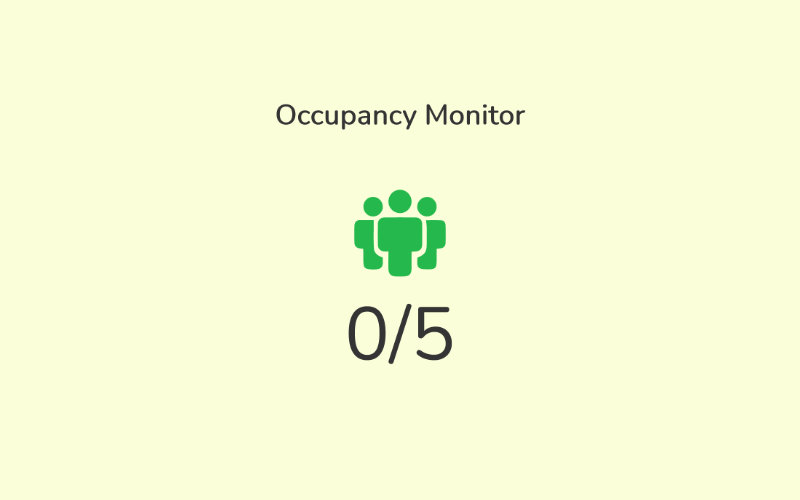
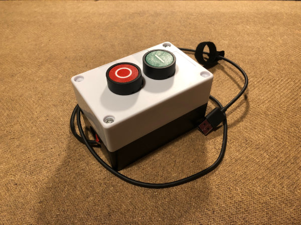
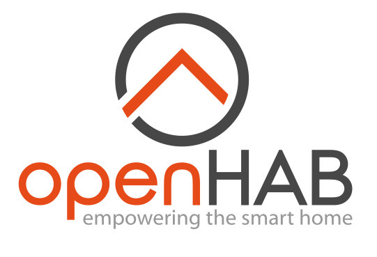

# Occupancy Monitor
> A maximum occupancy traffic light system created for a Hackathon.

## Server
> The server runs the monitor and provides a web interface that shows the number of people currently within the building.

### Installation
Run `server.js` in the `/server` directory. The following environment variables can be configured:
| Name | Description |
| ---- | ----------- |
| `SECRET` | The secret for client button communication |
| `MAX_PEOPLE` | The maximum occupants allowed |

## Client
> The client is a C++ program written for a NodeMCU ESP8266 chip (flashed through the Arduino software).

### Installation
Compile `client.ino` in the `/client` folder and upload it to a NodeMCU ESP8266, with two buttons connected to `D1/GND` (up) and `D2/GND` (down).

The constants at the top of the file will need to be configured according to your server

## OpenHab2
> An OpenHab2 installation can be used to change an RGB light's colour between green and red to indicate if the maximum occupancy has been reached.

### Installation
Install the HTTP binding and copy the rule, item and transform files from `/openhab` to the relevant places